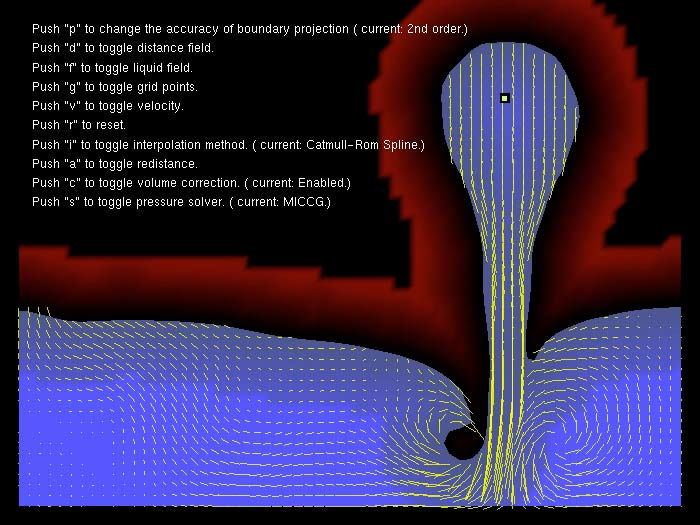
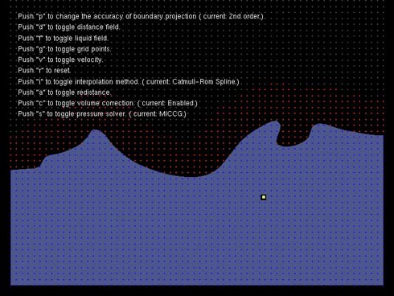

# levelset2d
The original levelset2d code was previously hosted on code.google.com/p/levelset2d by Ryoichi Ando. This code is a working solution build with VS2013. All required libraries to build this project are included with the solution. For windows, simply open the levelset_2D.sln file inside the VS2013 directory and press the build and run button.

# Demo screenshots

Pouring water

Pouring water

Stirring water
